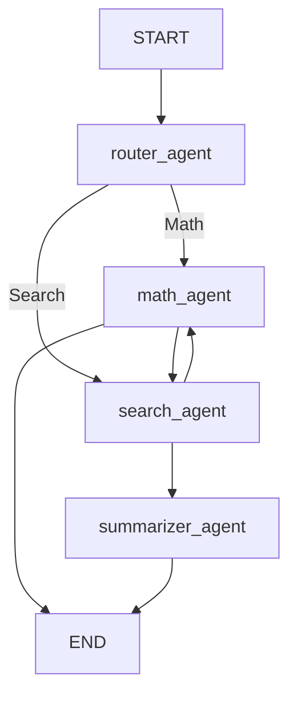

# LangGraph Agentic AI

A clean implementation of an **agentic AI workflow** using [LangGraph](https://github.com/langchain-ai/langgraph) and Google Generative AI (Gemini models).

This project demonstrates how to:
- Route user queries (math vs. general search)
- Solve math problems step by step
- Provide historical context (mathematicians’ contributions)
- Generate and solve similar math problems for practice
- Answer general knowledge queries
- Summarize long answers
- Run an interactive multi-agent workflow with LangGraph

---

## 🚀 Features
- **Router Agent** → Classifies queries into Math or Search.
- **Math Agent** → Solves math problems, explains steps, adds mathematician contributions.
- **Search Agent** → Provides detailed answers or generates similar math problems.
- **Summarizer Agent** → Summarizes long answers concisely.
- **Branching** → Queries dynamically route into different paths (Math or Search).
- **Looping** → Workflow supports repeated cycles (e.g., generating and solving extra math problems).
- **Interactive Workflow** → User can request summaries or extra practice problems.
- **Visualization** → Workflow diagram with LangGraph.

---

## 📦 Installation

Clone this repo and install dependencies:

```bash
pip install langchain-google-genai langgraph
```

If running in **Google Colab**, install with:

```python
!pip install langchain-google-genai langgraph
```

---

## 🔑 API Key Setup

This project uses **Google Generative AI (Gemini)**.

### Colab
```python
from google.colab import userdata
import os
os.environ["GOOGLE_API_KEY"] = userdata.get('GOOGLE_API_KEY')
```

### Local
```python
import os
os.environ["GOOGLE_API_KEY"] = "your-api-key-here"
```

Get your API key from [Google AI Studio](https://aistudio.google.com/).

---

## ▶️ Usage

Run the script:

```bash
python main.py
```

You’ll see:
```
Starting LangGraph Agentic AI System
==================================================
 Workflow Diagram:
```

Then enter a query when prompted:
```
Enter your query: Solve x^2 + 5x + 6 = 0
```

The system will:
1. Detect it’s a **Math Problem**
2. Solve step by step
3. Provide mathematician contributions
4. Ask if you want similar problems

For a general query like:
```
Enter your query: How does photosynthesis work?
```
It will:
1. Detect it’s a **Search Query**
2. Provide a detailed answer
3. Ask if you want a summary

---

## 🗂 Workflow Structure



---

## 📖 Example Output

### Input:
```
Enter your query: Solve x^2 + 5x + 6 = 0
```

### Output:
```
SOLUTION:
1. Recognize quadratic equation: x^2 + 5x + 6 = 0
2. Factorize: (x+2)(x+3) = 0
3. Solve for x: x = -2, -3
Final Answer: x = -2, -3

MATHEMATICIAN CONTRIBUTIONS:
1. Bhaskara II (1114–1185) – Early quadratic solutions
   Application: Provided formula used in quadratic solving
2. François Viète (1540–1603) – Viète’s formulas
   Application: Relationship between roots and coefficients
```

---

## 🛠 Improvements (Optional)
- Add **real web search** integration (e.g., Tavily, SerpAPI)
- Add **caching** to avoid repeated API calls
- Replace `input()` with UI/async for production
- Extend agents with **domain-specific tools**

---

